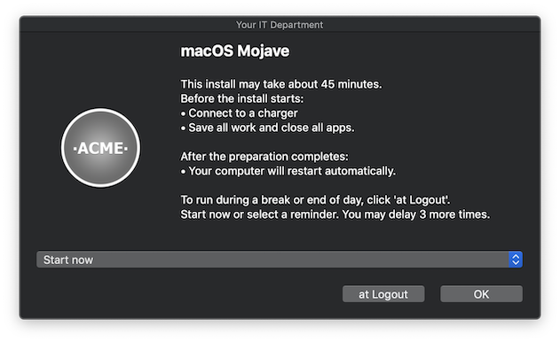
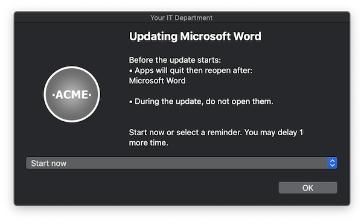
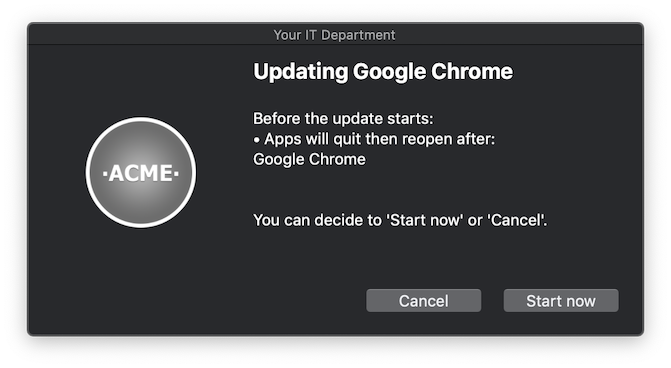
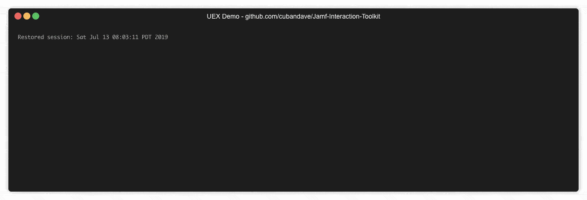

# Jamf-Interaction-Toolkit

___

Join the conversation @ **"#uex-tool-for-jamf"** On the MacAdmins Slack
___
# What is the Jamf Interaction Toolkit?

 

Jamf Interaction Toolkit, commonly known as UEX, was built with a few goals in mind:

* Setup software deployments that are:
  * Branded and trusted
  * Consistent across the enterprise 
  * Notify the user when apps need to be quit or to not be opened
  * Notify the user when the computer needs to be restarted
  * Allow the user to postpone the action based on number of times instead of an end date
* All of this has to be compatible with Jamf Pro.
* All of this has to be work tandem with Self Service.

Over time this tool has grown into a full set of versatile scripts that can essentially be used as your primary method for creating policies. 

**OR**

You can just use it for your next **macOS Upgrade**.

# What can it do?

The UEX Toolkit supports all types of deployment needs:

* User needs to Quit an application[s] before an policy starts
  * Prevent those apps from opening during the policy
  * Re-open apps previously quit after the policy runs.
* Inform the user of a restart or logout before a policy starts
  * Require the computer to be connected to [power](https://github.com/cubandave/Jamf-Interaction-Toolkit/wiki/09-Checks...-All-the-Options-for-UEX#power)
* Support running other policies after the user acknowledges a custom message [trigger](https://github.com/cubandave/Jamf-Interaction-Toolkit/wiki/09-Checks...-All-the-Options-for-UEX#trigger)
* Support forceful running of [Compliance Policies](https://github.com/cubandave/Jamf-Interaction-Toolkit/wiki/05-Compliance-Policies)
* [Detect if the user is in a presentation](https://github.com/cubandave/Jamf-Interaction-Toolkit/wiki/99-Presentation-Delay)
* [FileVault authenticated restarts](https://github.com/cubandave/Jamf-Interaction-Toolkit/wiki/07-FileVault-Authenticated-Restarts)
* [Apple Software Updates](https://github.com/cubandave/Jamf-Interaction-Toolkit/wiki/04---Apple-Software-Updates-via-UEX)
* [Detection of insufficient space and workflows to create tickets](https://github.com/cubandave/Jamf-Interaction-Toolkit/wiki/06-Space-Detection-Notification-Service-Desk-Tickets)

# What does it look like?

* Example of a policy at Check-in for a MS Word update
 
* Example of a Google Chrome update From Self Service
 

# How to use it?
1. Download the [latest release](https://github.com/cubandave/Jamf-Interaction-Toolkit/releases/latest)
1. Please check out the [Wiki Here ](https://github.com/cubandave/Jamf-Interaction-Toolkit/wiki)
1. Apply [Branding](https://github.com/cubandave/Jamf-Interaction-Toolkit/wiki/00-Setting-up-UEX-Including-Branding-and-Customising-UEX)
1. [Upload all required pieces to your Jamf Pro server.](https://github.com/cubandave/Jamf-Interaction-Toolkit/wiki/00-Setting-up-UEX-Including-Branding-and-Customising-UEX#uploading-to-your-jamf-pro-server)
1. Run the [API Config Tool](https://github.com/cubandave/Jamf-Interaction-Toolkit/wiki/00-Setting-up-UEX-Including-Branding-and-Customising-UEX#api-config-tool)

1. The world is your burrito. 🌯 ... [Creating Policies](https://github.com/cubandave/Jamf-Interaction-Toolkit/wiki/01-Creating-a-UEX-Policy)

